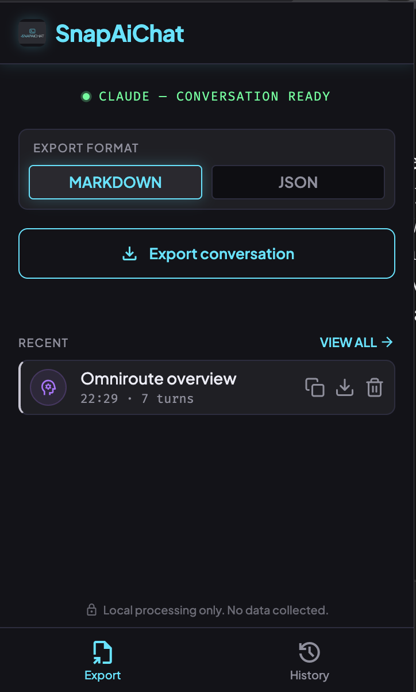
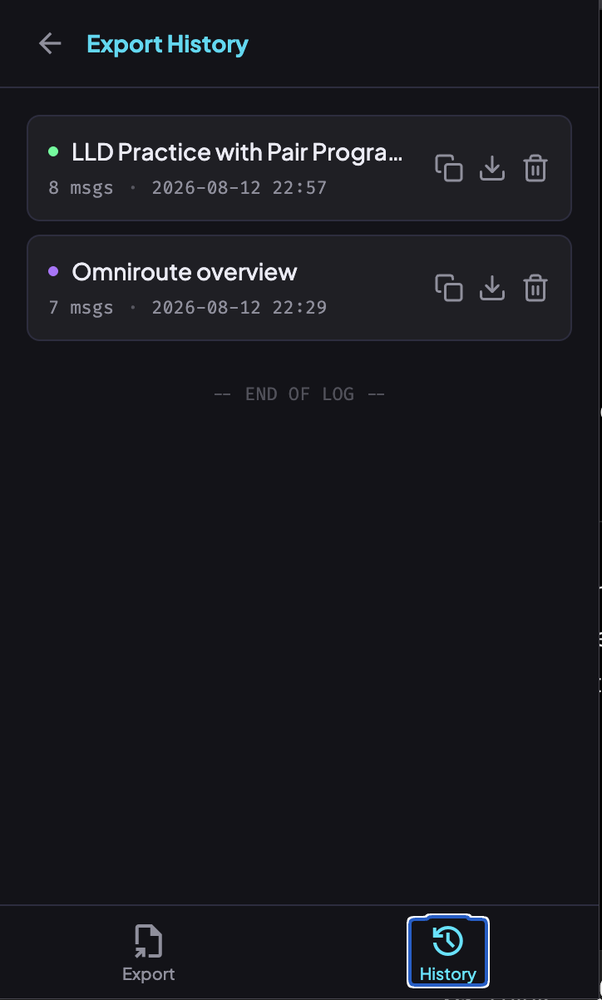

# SnapAiChat

A Chrome/Edge browser extension that lets you export your AI conversations from **ChatGPT**, **Claude**, and **Kimi** into clean **Markdown** or **JSON** — with a local history of everything you've saved.

Everything runs locally in your browser. No servers, no telemetry, no data collection.

---

## Features

- **One-click export** of the active conversation to **Markdown** (`.md`) or **JSON** (`.json`).
- **Local history** of every export, with quick **Copy** and **Download** actions and **Delete** to clean up.
- **Recent** list on the export view for your latest saves.
- **Status indicator** that detects the active site and whether a conversation is ready to export.
- **Self-hosted fonts & icons** (Plus Jakarta Sans, Fira Code, Material Symbols) — no external network requests.
- **100% local**: exports are processed and stored in your browser's local storage only.

## Screenshots

> Drop your images into [`assets/screenshots/`](./assets/screenshots) using the exact filenames below.

| Export view | History view |
| ----------- | ------------ |
|  |  |

## Supported sites

| Platform | Hosts |
| -------- | ----- |
| ChatGPT  | `chatgpt.com`, `openai.com` |
| Claude   | `claude.ai` |
| Kimi     | `kimi.com`, `moonshot.cn` |

---

## Installation (Load Unpacked)

This extension is distributed as unpacked source (no Web Store listing yet).

### Chrome / Edge / Brave
1. Open `chrome://extensions` (or `edge://extensions`).
2. Enable **Developer mode** (toggle in the top-right).
3. Click **Load unpacked**.
4. Select the **`chrome-extension`** folder in this repository (the folder that contains `manifest.json`).
5. The **SnapAiChat** icon appears in your toolbar. Click **↻ reload** any time you pull updates.

### Firefox
Firefox uses a slightly different manifest format. Load it via `about:debugging` → *This Firefox* → **Load Temporary Add-on**, and pick the `manifest.json`. (A Firefox-tuned manifest may be added later.)

> After building/modifying files, return to the extensions page and hit **reload** on SnapAiChat so the new code is picked up.

---

## Usage

1. Open a conversation on a supported site (ChatGPT, Claude, or Kimi).
2. Click the **SnapAiChat** toolbar icon to open the popup.
3. Pick a format — **MARKDOWN** or **JSON** — using the format toggle.
4. Click **Export conversation**. The file downloads immediately and is added to your history.
   - If the page shows *"No active chat detected"*, open/refresh a conversation first, then click **Export** again.
5. Use the **History** tab (or **VIEW ALL** in the Recent section) to:
   - **Copy** the Markdown to your clipboard,
   - **Download** it again,
   - **Delete** it from local history.

### Notes
- Exports are saved in your browser's local storage (`chrome.storage.local`). Clearing site data or using a different browser/device will not share them.
- The extension needs the page to be fully loaded before exporting; if a probe fails, reload the chat page and retry.

---

## Project structure

```
chrome-extension/
├── manifest.json          # MV3 manifest (permissions, hosts, action, icons)
├── popup/                 # Extension popup UI
│   ├── popup.html
│   ├── popup.css
│   └── popup.js
├── content/               # Content scripts injected into chat pages
│   ├── selectors.js
│   ├── dom-to-markdown.js
│   ├── adapters.js
│   └── content.js
├── shared/                # Logic shared between popup and content scripts
│   ├── export-core.js
│   ├── archive-store.js
│   └── clipboard.js
├── assets/                # Logo + bundled fonts
│   └── fonts/
└── icons/                 # Extension/toolbar icons (16/48/128)
```

---

## Privacy

- No external network calls are made by the extension. Fonts and icons are bundled.
- No analytics, no remote servers, no account required.
- Your conversations never leave your machine except when you choose to download or copy them.

---

## Credits

- **Developed with [DeepSeek-v4-flash](https://www.deepseek.com) via the OpenCode CLI** — the extension logic and build were created using the OpenCode command-line assistant.
- **UI designed with Google Stitch** — the popup layout, dark theme, and visual system were prototyped in Google Stitch.

## License

SnapAiChat is licensed under the **Apache License, Version 2.0** — see [`LICENSE`](./LICENSE) and [`NOTICE`](./NOTICE).

This means anyone may use, copy, modify, and distribute the code (including in commercial products) with attribution and without warranty ("AS IS"), and there is an explicit patent grant. If you redistribute a modified version, keep the license, carry prominent notices of your changes, and preserve the `NOTICE` file.

**Bundled third-party assets** retain their own licenses, independent of the project license above:

- **Plus Jakarta Sans** — SIL Open Font License 1.1 (`assets/fonts/OFL-PLUS_JAKARTA_SANS.txt`)
- **Fira Code** — SIL Open Font License 1.1 (`assets/fonts/OFL-FIRA_CODE.txt`)
- **Material Symbols** — Apache License 2.0 (`assets/fonts/LICENSE-APACHE2-MATERIAL_SYMBOLS.txt`)
